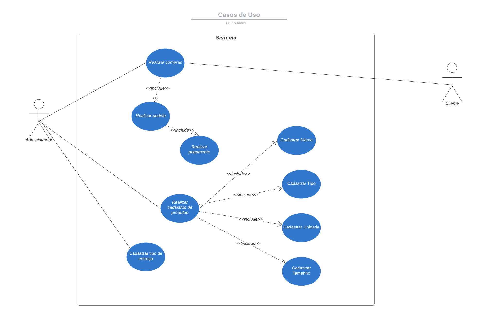
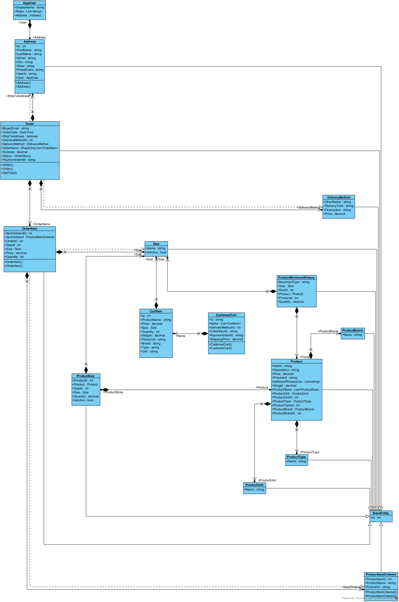
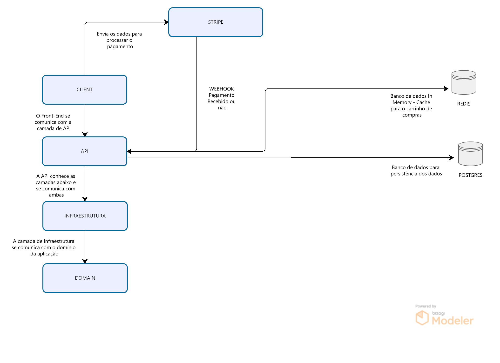
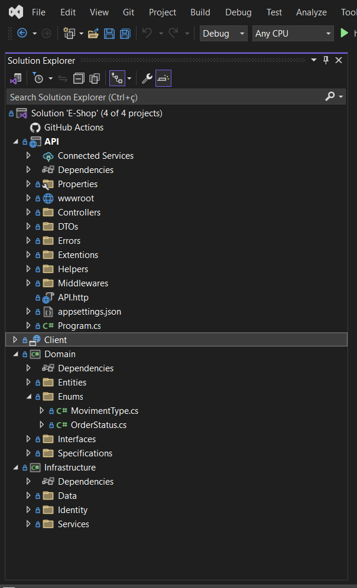
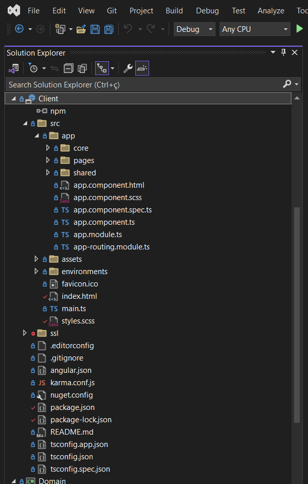

# E-Shop: Uma Plataforma de Comércio Eletrônico em .NET e Angular

<p> Este projeto é um e-commerce desenvolvido em .Net usando ASP.NET Core, Entity Framework, Identity Framework e outras ferramentas e Angular usando NGX-Bootstrap, Angular Material entre outros. </p>
<p>
Sua finalizade é estudar diversos pontos da engenharia de software, o principal arquitetura de software.
</p>
<p>
Este projeto visa implementar de uma forma simples a Clean Architecture, sendo o mais simples possível, portanto utilizo 4 camadas, Domain, Infrastruture, API e Client.
O meio de pagamento deste projeto é o STRIPE, não sendo guardado dados do cartão de crédito do cliente em nenhuma forma no sistema.
Este projeto ainda está em desenvolvimento.
</p>

## Como Rodar o projeto
Primeiro, recomendo fortemente que utilize o Visual Studio 2022 Community Edition para este projeto.

Passo 1: Faça o donwload e instalação do .NET 8 SDK: Você pode encontrar neste <a href="https://dotnet.microsoft.com/pt-br/download/dotnet/8.0">link</a>.<br>
Passo 2: Baixe o código da aplicação: Você pode clonar o repositório ou baixar o código como um arquivo ZIP.<br>
Passo 3: Instale as dependências do projeto: Navegue até a pasta do projeto no terminal e execute o comando dotnet restore. Isso irá baixar e instalar todos os pacotes NuGet necessários para o projeto.<br>
```
dotnet restore
```
Passo 4: Instalar e configurar o PostgresSql: Você pode encontrar neste <a href="https://www.postgresql.org/download/">link</a>.<br>
Passo 5: Instalar o Docker: Você pode encontrar neste <a href="https://www.docker.com/products/docker-desktop/">link</a>.<br>
Passo 6: Realizar a configuração do Redis no Docker: Há um arquivo de configuração docker-compose.yml na pasta raiz do projeto, este arquivo tem o seguinte conteúdo.<br>
```
services:

  redis:
    image: redis:latest
    ports:
      - 6379:6379
    command: ["redis-server", "--appendonly", "yes"]
    volumes:
      - redis-data:/data

  redis-commander:
    image: rediscommander/redis-commander:latest
    environment:
      - REDIS_HOSTS=local:redis:6379
      - HTTP_USER=root
      - HTTP_PASSWORD=secret
    ports:
      - 8081:8081
    depends_on:
      - redis
    
volumes:
  redis-data:
```
<br>
Para facilitar, basta abrir o powershell na pasta com este arquivo e rodar o seguinte comando.

```
docker-compose up --detach
```
<br>
Passo 7: Alterar as configurações da conexão com o Postgres do projeto: Na pasta API no arquivo appsettings.json alterar as configurações do Host, Database, Username e Password.

```
 "ConnectionStrings": {
    "DefaultConnection": "Host=localhost; Database=eshop; Username=postgres; Password=master",
    "IdentityConnection": "Host=localhost; Database=eshop-users; Username=postgres; Password=master",
    "Redis": "localhost"
  }
```
<br>
Passo 8: Rodar os comandos para gerar os bancos de dados:
No Nuget Console

```
Update-Database -Context AppIdentityDbContext -Project Infrastructure
Update-Database -Context StoreDbContext -Project Infrastructure
```
No console
```
dotnet ef database update -c AppIdentityDbContext -p .\Infrastructure\Infrastructure.csproj
dotnet ef database update -c StoreDbContext -p .\Infrastructure\Infrastructure.csproj
```
<br>
Passo 9: Atualize os dados de integração com a Stripe: No arquivo appsettings.json e no controlador em API/Controllers/PaymentController.cs
No appsettings.json

```
"StripeSettings": {
    "PublishableKey": "pk_test_51Om2WKFYstaow4m6KfJj2wUSpP1bSN3tpmcODZ1VIhUBROorNrCJApeWZOmbelyop5RGgW6OxfRYGp2oenFIg7SN00CDM2mNSQ",
    "SecretKey": "sk_test_51Om2WKFYstaow4m6BaQSJBdsWn3eXD3NOhkvrsjhmBu0mdP9on3aCosHSUnCgZIc96UFstTyGXGAuhCi5gnr00Ym00x8cPCnmV"
  }
```
No controller
```
private const string WebhookSecret = "whsec_733c88e502c45981dd8a7a7880680e7f46cb6aa9481671634592ffc4481b737f";
```
<br>
Passo 10: Realize a insatalação do listener da stripe: no meu caso eu utilizo o arquivo stripe.exe rodando via terminal, no seu caso pode ser diferente, validar a documentação e configuração do listener para a seu caso, segue <a href="https://docs.stripe.com/webhooks?locale=pt-BR">link</a>.<br>

Passo 11: Instale o Angular CLI: segue <a href="https://angular.io/cli">link</a>

Passo  12: Construa e execute a aplicação backend: Ainda no terminal, você pode construir a aplicação com o comando dotnet build e depois executá-la com dotnet run, ou clicar no simbolo de play no VS2022.
Na pasta API abra o terminal ou execute o projeto API pelo VS2022

```
dotnet build
dotnet run
```

Passo 12: Execute o front end da aplicação: Com um console na pasta Client rode o seguinte comando.
```
ng s
OU
ng serve
```
<br>
## Introdução
<p>  
O comércio eletrônico é uma área de crescente importância na sociedade atual, sendo este avanço ainda maior nos anos pós pandemia onde ocorreu o aumento do consumo online e mudança de hábitos de compras dos consumidores (CASTRO, 2023). O desenvolvimento de um aplicativo de e-commerce permitirá explorar e entender melhor os desafios e oportunidades desse mercado em constante expansão, agregando assim relevância ao TCC.</p>
<p>
A escolha das tecnologias .NET e Angular se dá pois ambas são ferramentas amplamente utilizadas no desenvolvimento web e oferecem ferramentas poderosas para a criação de aplicações modernas e escaláveis, sendo assim aprofundar se nessas tecnologias permitirá adquirir habilidades técnicas valiosas em alinhamento com o mercado de trabalho atual.
A escolha da arquitetura limpa para o desenvolvimento do aplicativo se dá por sua manutenibilidade do código, através de sua divisão em várias camadas como por exemplo as camadas de Apresentação, Aplicação, Infraestrutura e Domínio. Esta arquitetura comumente aplica conceitos de design de software como Inversão de dependência, código limpo, onde temos uma aplicação robusta, flexível e adaptável para futuras mudanças. Com isso será possível demonstrar competências em design de software e organização de projetos e código.
</p>
<p>
	O objetivo geral é desenvolver um aplicativo de e-commerce utilizando as tecnologias .NET e Angular seguindo os princípios da Clean Architecture, para oferecer aos usuários uma plataforma eficiente, segura e intuitiva para realização de compras online, contribuindo para modernização do comércio eletrônico e a comunidade de desenvolvedores.
Para atingir o objetivo geral proposto, faz-se necessário atingir os objetivos específicos:
</p>
<p>
Análise de Requisitos e Definição de Escopo;
* Escolha de Tecnologias e Arquitetura;
* Desenvolvimento do Back End em Asp.NET implementando os requisitos e arquitetura definida;
* Desenvolvimento do Front End utilizando o framework Angular;
* Integração com a plataforma de pagamentos Stripe;
* Documentação e Entrega;
* Apresentação e Conclusão;
</p>
<p>
	A escolha por desenvolver este aplicativo com a plataforma .NET e Angular integrando com a ferramenta de pagamentos Stripe e seguindo a arquitetura limpa, é justificável por sua relevância no contexto e mercado atual, através da contribuição potencial para a comunidade e a aplicação das habilidades técnicas, estes fatores transformam o projeto em um desafio estimulante e valioso para o TCC.
</p>


## Diagramas
O desenvolvimento do sistema começa com o levantamento de requisitos, que são transformados em diagramas para facilitar a compreensão e implementação do sistema. Abaixo podemos observar os diagramas de Caso de Uso (Figura 1), de Classe (Figura 2) e um fluxo de como a arquitetura do sistema funciona (Figura 3).

Figura 1: Diagrama de Caso de Uso


Figura 2: Diagrama de Classe


Figura 3: Demonstração do fluxo da arquitetura



## Arquitetura

A Arquitetura Limpa, também conhecida como “Clean Architecture”, é um modelo de design de software proposto por Robert C. Martin, também conhecido como Uncle Bob. Ela é organizada em camadas concêntricas, onde cada camada depende da camada imediatamente interna a ela. Vamos explorar as quatro camadas mencionadas: Domain, Infrastructure, API e Client realizadas por meio do ASP.NET Core 8.

- **Domain**: Esta biblioteca contém as regras de negócio da aplicação. Ela é independente de qualquer estrutura externa e é onde residem as entidades, que são os objetos que incorporam as regras de negócio. Como é uma biblioteca, ela pode ser facilmente reutilizada em diferentes partes da aplicação ou em diferentes aplicações.
- **Infrastructure**: Esta biblioteca fornece suporte técnico para as outras camadas. Ela contém tudo o que é necessário para fazer a aplicação funcionar, mas que não está diretamente relacionado com as regras de negócio, como a integração com bancos de dados, servidores, frameworks, etc. No caso do .NET Core, esta biblioteca pode conter a configuração e a implementação dos serviços do .NET Core, como o Entity Framework Core para o acesso a dados.
- **API**: A camada de API é uma aplicação ASP.NET Core que expõe as funcionalidades do domínio através de uma API REST. Esta camada recebe as requisições dos clientes, as processa e retorna as respostas. Ela usa as bibliotecas de domínio e infraestrutura para realizar seu trabalho.
- **Client**: Esta é a camada mais externa e é onde os usuários interagem com a aplicação. Pode ser uma interface de usuário web, um aplicativo móvel, um script, etc. Esta camada faz requisições para a API REST para acessar as funcionalidades da aplicação.

A Arquitetura Limpa permite que as regras de negócio sejam facilmente testadas e que a aplicação seja facilmente mantida e estendida, pois as dependências são direcionadas para o interior. Isso significa que as camadas mais externas podem ser alteradas sem afetar as camadas mais internas.

## Sistema funcional e código fonte

A seguir, apresentamos a demonstração da arquitetura planejada através do código fonte e sua organização do código.

Figura 4: Código Fonte Geral


Figura 5: Código Fonte Front-End 


Todo sistema deve ter um meio de login e registro de usuários, portanto iniciamos demonstrando suas telas.

Figura 6: Tela de login


Figura 7: Tela de registro


Figura 8: Tela de registro - Registrando


A principal funcionalidade do software é permitir que os clientes comprem produtos. A a seguir demonstro o fluxo de compra.

Figura 9: Tela inicial do sistema


Figura 10: Loja  Listagem de produtos


Figura 11: Loja - Adicionar produtos pela tela de listagem, filtrar, grifado em vermelho a funcionalidade após escolher o tamanho do produto.


Figura 12: Loja - Detalhes do produto, grifado em vermelho a funcionalidade um slide contendo as imagens do produto.


Figura 13: Loja - Carrinho


Figura 14: Loja - Finalização Pedido - Conferir de Endereço


Figura 15: Loja - Finalização Pedido - Método de entrega


Figura 16: Loja - Finalização Pedido - Revisar


Figura 17: Loja - Finalização Pedido - Pagamento


Figura 18: Loja - Pedido realizado


Figura 19: Loja - Listagem de pedidos


Figura 20: Loja - Detalhes de pedido


A venda é validada pela provedora de pagamentos, a Stripe. Primeiro, é criada uma intenção de pagamento.

Figura 21: Loja - Criação da Intenção de pagamento


Figura 22: Confirmação Stripe


Figura 23: Pagamento recebido - Stripe


Figura 24: Pagamento recebido - Stripe - Detalhes


## Area do administrador

Figura 25: Listagem de marcas


Figura 26: Cadastro de marcas


Figura 27: Edição de marcas


Figura 28: Listagem de tipos


Figura 29: Cadastro de tipos


Figura 30: Edição de tipos


Figura 31: Listagem de unidades


Figura 32: Cadastro de unidades


Figura 33: Edição de unidades


Figura 34: Listagem de tamanhos


Figura 35: Cadastro de tamanhos


Figura 36: Edição de tamanhos


Figura 37: Listagem de produtos


Figura 38: Cadastro de produtos


Figura 39: Edição de produtos


Figura 40: Listagem de metodos de entrega


Figura 41: Cadastro de metodos de entrega


Figura 42: Edição de metodos de entrega


Figura 43: Listagem de movimentações de estoque


Figura 44: Cadastro de movimentações de estoque


## Considerações Finais 

Embora o sistema execute operações de venda e recebimento de pagamentos, ele deve ser visto como um protótipo, necessitando de melhorias, como a inclusão de mais meios de pagamento. A funcionalidade de movimentação de estoque ainda está em desenvolvimento.

Todas as funcionalidades inicialmente propostas foram implementadas com sucesso, seguindo a arquitetura e metodologia propostas. Para cumprir os prazos, optou-se por uma versão simplificada do processo, omitindo etapas como as Sprint Reviews.


